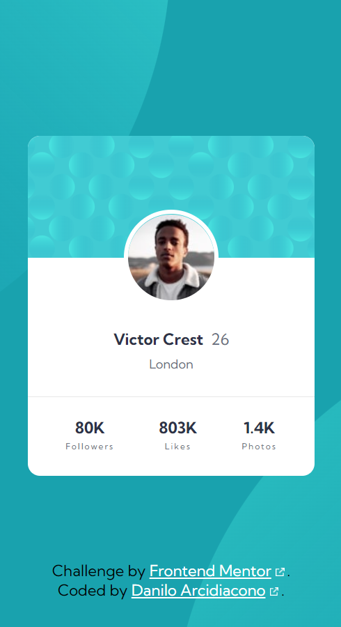

# Frontend Mentor - Profile card component solution

This is a solution to the [Profile card component challenge on Frontend Mentor](https://www.frontendmentor.io/challenges/profile-card-component-cfArpWshJ). Frontend Mentor challenges help you improve your coding skills by building realistic projects. 

## Table of contents

- [Overview](#overview)
  - [The challenge](#the-challenge)
  - [Screenshot](#screenshot)
  - [Links](#links)
- [My process](#my-process)
  - [Built with](#built-with)
  - [What I learned](#what-i-learned)
  - [Useful resources](#useful-resources)
- [Author](#author)

## Overview

### The challenge

- Build out the project to the designs provided

### Screenshot

### Links

- Solution URL: [Github](https://github.com/daniloarcidiacono/frontendmentor-profilecard)
- Live Site URL: [Github Pages](https://daniloarcidiacono.github.io/frontendmentor-profilecard/)

## My process

### Built with

- Semantic HTML5 markup
- Sass
- CSS custom properties
- CSS logical properties
- Flexbox

### What I learned

Negative margins can be used to pull elements.

### Useful resources

- [Understanding CSS Percentage](https://dev.to/khangnd/understanding-css-percentage-44gd) - Nice article on CSS percentage unit.

## Author

- Github - [Danilo Arcidiacono](https://github.com/daniloarcidiacono)
- Frontend Mentor - [@daniloarcidiacono](https://www.frontendmentor.io/profile/daniloarcidiacono)
